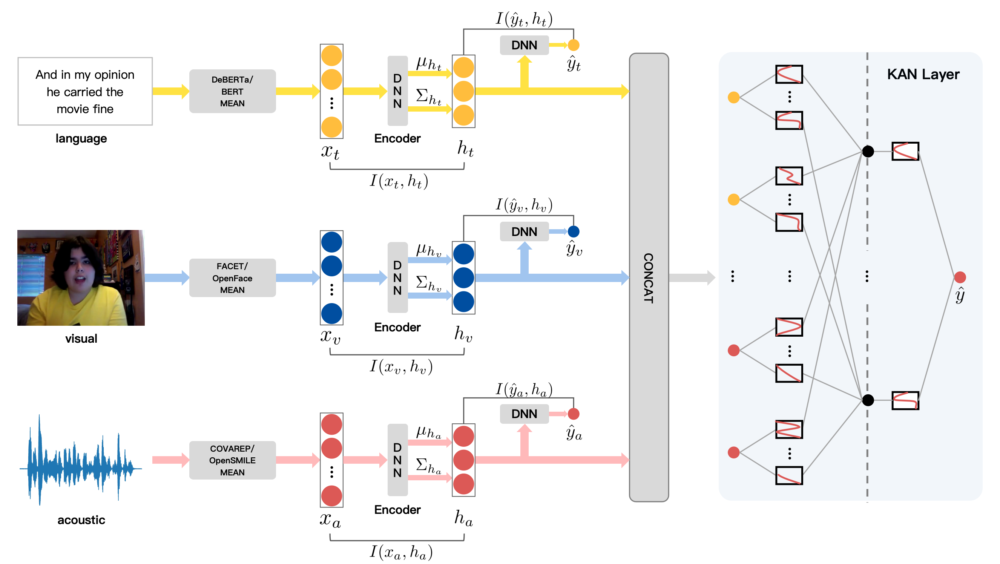

# Kolmogorov-Arnold Networks with the Multimodal Clean Pareto (KAN-MCP)

This repository hosts the official code for the paper “Towards Explainable Fusion and Balanced Learning in Multimodal Sentiment Analysis”. KAN-MCP is accepted by ACM MM 2025!

## 📖 Overview

KAN-MCP, a novel framework that integrates the interpretability of Kolmogorov-Arnold Networks (KAN) with the robustness of the Multimodal Clean Pareto (MCPareto) framework.



## 🚀 Datasets and Models Download

### Datasets

```yaml
https://www.dropbox.com/s/sv94igp7zi3rsj1/mosi.pkl?dl=1
https://www.dropbox.com/s/995dvj3506gvk5a/mosei.pkl?dl=1
```

### Models

https://huggingface.co/microsoft/deberta-v3-base

## 🚢 Quick Start

1. You can quickly set up the environment as follows:

```yaml
git clone https://github.com/LuoMSen/KAN-MCP.git
cd KAN-MCP-main
conda create -n KANMCP python=3.8
pip install --upgrade pip
pip install -r requirements.txt
```

1. Download the datasets to `./datasets`
2. Download the Deberta model to `./microsoft/deberta-v3-base`
3. Train the model on MOSI or MOSEI datasets:

```yaml
python train_mosi.py
python train_mosei.py
```
